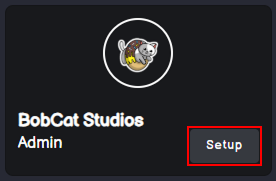

# Getting Started with your Discord Bot

On this page, you’ll quickly learn about BobCat, including:

* How to log in, install, and access the dashboard
* What the bot's plugins are
* How to enable and configure our plugins

### **How to login, Install and access our dashboard**

In order to let **BobCat** know what servers you can configure, you will have to log in with your Discord account in to our **dashboard**


```
If you're not already logged into Discord, a diffrent screen will be visible.
```


Once logged in, you can add BobCat to your server by clicking on "**Setup**" button.


<div data-full-width="true"><figure><figcaption></figcaption></figure></div>

### **What are BobCat's Plugins?**

Plugins are features, individual components that power BobCat to do cool things. To use them, you'll need to enable and configure each one individually. Here's an example of what is possible:

* Give your new members a nice warm welcoming or make sure they are human (Welcome and Verification)
* Be the boss of your server or give special pepople of your server the power too (Moderator plugin)
* Improve community engagement via XP for chatting and economy games (Levels and Economy plugins)
* And so much more!

The dashboard is divided into two main sections, as seen below:

BobCat interface was carefully crafted by our amazing designers, to let you easily switch between plugins and configure your bot.\
Green section is called Plugin Index. It is used to navigate between the plugins you want to configure.\
Red section is Plugin Configuration area, where you can customize specific features of a selected plugin.

### **How To Get the Best out of Your Bot**

Now that you know how to log in, invite MEE6 to your server, and configure plugins, it's time to enhance your experience even further.\
As the very first step consider having a look at your dashboard's settings, as seen below:


Administrator roles have full access to your MEE6 dashboard and Discord server settings.\
This kind of permissions can be granted\removed only by enabling\disabling the toggle for each specific role inside your Discord server settings. Visit **Discord server settings -> roles -> select role that you want to change -> permissions -> scroll to the bottom -> administrator**.
